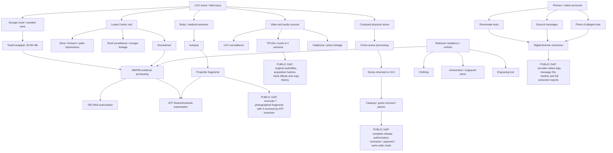
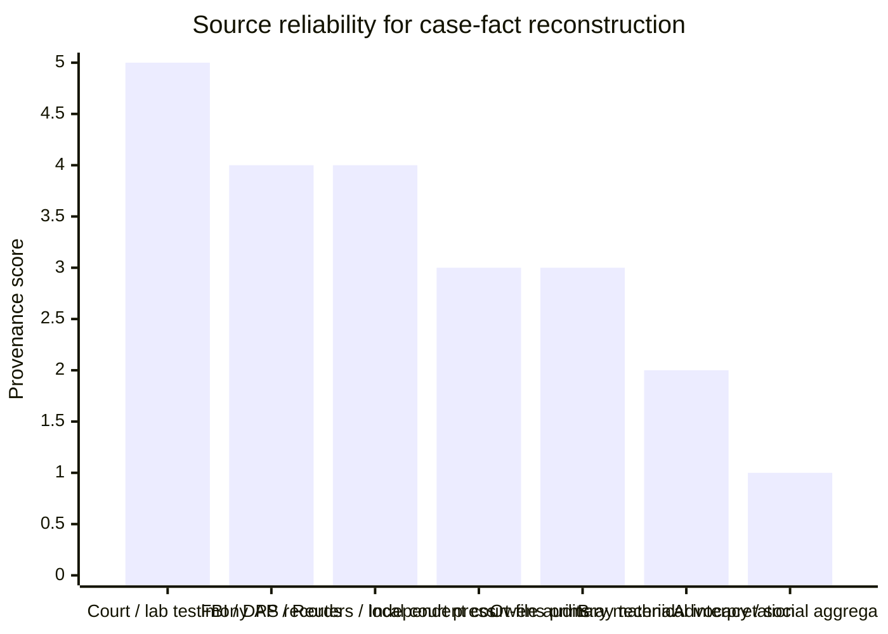
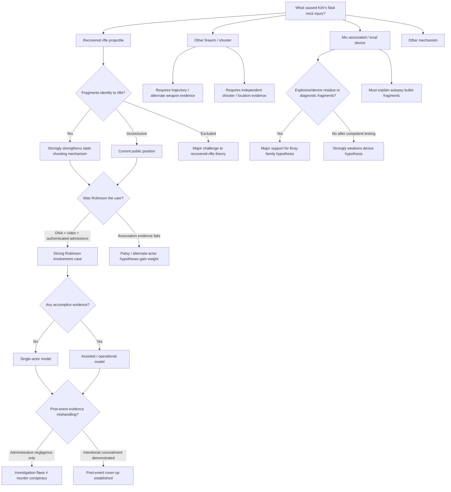

# Charlie Kirk Assassination Case: An Adversarial Evidence Audit for Erebus

> **Repo note — August 25, 2026:** In this committed copy of the founder-supplied brief, the platform's prior working name (19 occurrences) has been replaced with "Erebus" throughout, per this repository's name guard. No other content was altered; filenames were likewise renamed. The original file is preserved locally by the founder.

> **Revision note — August 25, 2026:** This edition adds detailed audits of Israel/donor-pressure evidence, TPUSA/event-personnel conduct, A/V evidence custody, venue and security planning, and post-event statement discrepancies. It distinguishes documented actions from disputed interpretations and does not treat a misleading or inaccurate statement as proof of operational involvement in the assassination.

## Executive summary

This report treats the September 10, 2025 killing of Charlie Kirk at Utah Valley University as an **open evidentiary problem rather than a settled narrative**, while also distinguishing legitimate unanswered questions from claims that presently outrun their evidence. That approach is consistent with Erebus's stated method: break contested narratives into atomic claims, show evidence for and against each claim symmetrically, preserve provenance, and identify the experiment or disclosure that could resolve the dispute. citeturn12view0

The public case against Tyler James Robinson is substantially stronger than a simplistic “the government says so” formulation suggests. The state has presented surveillance evidence tracking a suspect on and around campus; a person running from the Losee Center roof immediately after the shot; physical impressions and a screwdriver on that roof; a towel-wrapped .30-06 bolt-action rifle recovered along the apparent escape route; DNA evidence linking Robinson to multiple items; clothing, ammunition and an engraving tool recovered during searches; alleged pre- and post-shooting communications; an alleged note; a recorded statement from his roommate; and a Discord message shortly before surrender in which Robinson allegedly said that he was responsible. citeturn2view2turn15view2turn21search9turn25news27

But **several important propositions are less closed than early official and media accounts implied**. Most significantly, an ATF firearms examiner testified that bullet fragments recovered during the autopsy could not be conclusively identified as having been fired from the recovered rifle. “Inconclusive” is not the same as exclusion—the weapon has not thereby been ruled out—but it means the strongest possible direct ballistic proposition, *this fatal projectile was microscopically identified to this rifle*, has not been established publicly. NIST itself emphasizes that firearm/toolmark comparison involves examiner judgments, recognizes “inconclusive” as a distinct outcome from identification and exclusion, and cautions against oversimplifying error rates or damaged-bullet comparisons. citeturn21search9turn22search16turn22search19turn22search8

There is also a potentially important **fragment-accounting question**. At the July 2026 preliminary hearing, ATF examiner Samantha Carner testified that photographs showed seven fragments originally recovered, whereas she received four for examination. That may have an entirely routine explanation—some fragments could have been retained by the medical examiner, separately packaged, consumed in another test, deemed unsuitable, or transferred elsewhere—but the public record should contain a fragment-by-fragment reconciliation. Until it does, this is a genuine chain-of-custody question, not proof of evidence manipulation. citeturn21search9

The medical evidence is simultaneously powerful and incompletely auditable from outside the case. The medical examiner's report was admitted at the preliminary hearing and was summarized as finding death from a **gunshot wound to the neck**, with the manner of death homicide; projectile fragments were recovered at autopsy. Yet the medical examiner did not personally testify at the preliminary hearing, and the complete autopsy photographs, wound-track measurements, fragment map and detailed pathology findings have not been publicly available in a form that would let independent forensic pathologists test competing trajectory or “exploding microphone” claims. The defense objected when the report was introduced through an investigator rather than its author. citeturn15view3turn11search5

The public DNA evidence is meaningful but should not be overstated. Testimony linked Robinson's DNA to the rifle and other evidence, with a very high reported statistical association on some samples. But DNA answers principally a **source question**—whose biological material is represented—not necessarily the **activity question** of when, why or during what act it was deposited. At the hearing, defense questioning explicitly explored transfer possibilities. The distinction matters particularly if a firearm had previously been handled within Robinson's household or social environment. citeturn15view2turn21search9

The report also requires a separate **Israel/donor-pressure evidence cluster**. Authenticated private messages show that Kirk had recently lost or believed he had lost a donor worth roughly $2 million annually over his refusal to cancel Tucker Carlson, expressed anger toward some Jewish donors, and wrote that the pressure was leaving him “no choice” but to leave the pro-Israel cause. A Hamptons gathering involving Kirk, Bill Ackman and conservative influencers is acknowledged, while accounts of a coercive “intervention,” threats or blackmail remain sharply disputed. Netanyahu reacted rapidly to the shooting and later framed Kirk’s death ideologically, but his initial prayer post was contemporaneous with many other leaders’ reactions and his later denials followed public accusations. This cluster strongly establishes political and financial conflict; it does **not** currently provide communications, payments, surveillance, logistics or other bridge evidence connecting Israel, donors or meeting participants to the attack. ([authenticated-text reporting](https://www.timesofisrael.com/jewish-donors-play-into-all-the-stereotypes-charlie-kirk-wrote-in-leaked-texts-before-murder/); [Hamptons allegation](https://thegrayzone.com/2025/09/15/bill-ackman-israel-intervention-charlie-kirk/); [Ackman denial](https://nypost.com/2025/09/16/media/bill-ackman-denies-candace-owens-claim-he-staged-charlie-kirk-intervention-over-israel/))

A second underdeveloped issue is the **TPUSA/event-media chain**. Public hearing testimony says Terryl Farnsworth of Visual Impulse initially supplied what an investigator believed was a flash drive and then downloadable electronic versions on September 10, 2025; Owens has published footage and commentary alleging that Farnsworth removed the rear camera’s SD card within minutes and later gave explanations inconsistent with a signed SBI statement. The first proposition—same-day delivery of copies—is supported by sworn testimony. The public record does not yet establish the complete disposition of every original SD card, the hashes and export history of every file, or whether later public descriptions accurately distinguished originals from copies. This is a genuine chain-of-custody and candor issue, but no reviewed evidence presently connects the handling to alteration of the footage or participation in the killing. ([preliminary-hearing transcript](https://www.rev.com/transcripts/ut-v-tyler-robinson---day-1); [Owens episode transcript](https://podprose.org/post/1121/candace-owens-liar-liar-tpusa-fire-more-exclusive-footage-transcript))

The case also contains documented reasons not to grant officials unlimited epistemic deference. Early in the manhunt, authorities detained and released people who were not the charged defendant; official information changed rapidly. More consequentially, in June 2026 Judge Tony Graf held Deputy Utah County Attorney Christopher Ballard in civil contempt for violating the court's pretrial-publicity restrictions after Ballard spoke publicly about the strength of the evidence. Ballard said his media activity was intended in part to counter misinformation surrounding the inconclusive ballistics evidence. The judge expressly said the contempt finding did not determine the merits of the prosecution, but it establishes that **narrative-management incentives existed inside the prosecutorial team**, rather than being merely imagined by skeptics. citeturn24search15turn24news22

The prosecution had earlier defended the unusually rapid decision to file notice that it would seek the death penalty partly on the ground that prompt action would minimize misinformation and speculation. That is not evidence that the evidentiary case is false, but it is relevant institutional context: officials were consciously concerned with controlling the public informational environment while the investigation was developing. citeturn5view1

At the same time, **skepticism must be symmetrical**. The existence of official mistakes, prosecutorial publicity violations, unexplained evidence handling, or premature certainty does not convert an alternative hypothesis into fact. A criminal cover-up requires evidence of concealment, fabrication or coordinated obstruction—not merely evidence that a scene was cleaned quickly, an official spoke too confidently, or a forensic test was inconclusive.

That distinction is especially important for **Candace Owens' investigation**. Owens has surfaced potentially valuable private material, witnesses, photographs, messages and timeline discrepancies that conventional reporting might otherwise miss. Her program therefore deserves to be mined as a *lead generator*. But she repeatedly moves from “this fact is unexplained” to much stronger suspicions about TPUSA insiders, security personnel, political donors, Israel, or other actors without publicly supplying the authentication and causal evidence needed for those escalations. Her own July 24, 2026 program, for example, acknowledged that she had **not confirmed** a reported pre-shooting meal involving Ben Shapiro, even while exploring the allegation at length. citeturn8view2

One particularly important correction to Owens' “timeline of lies” presentation concerns the rooftop escape. She argues that footage showing the rooftop figure moving almost immediately after the shooting is incompatible with a story in which the shooter first disassembled the rifle. Yet in the official FBI updates and charging-related materials reviewed for this report, I found **no primary governmental assertion that Robinson disassembled the rifle on the roof after the shot**. A screwdriver was indeed recovered from the roof, but the existence of a screwdriver does not itself establish post-shot rifle disassembly. Until an official witness or document actually makes that claim, the alleged time contradiction is better classified as a potential **straw-man contradiction** than evidence that the official chronology is impossible. Owens herself presents portions of this reconstruction as what she believes authorities are “implying.” citeturn18search1turn2view2turn19search25

The **Jon Bray alternative scenario**—the user's “John Bray” appears to refer to Jon Aaron Bray—is more technically falsifiable and therefore analytically useful. Bray argues that a concealed device associated with Kirk's wireless microphone produced the fatal trauma, while the apparent rooftop shot functioned as a decoy or secondary event. Proponents point to perceived shirt deformation, necklace movement, an allegedly ejected object, claims about the microphone assembly, and photographs said to show plastic-like debris in the SUV used to transport Kirk. citeturn23search0turn23search5turn23search6

At present, however, the explosive-microphone hypothesis has a **substantial evidentiary deficit**. It must explain why the medical examiner classified the fatal injury as a gunshot wound; why bullet fragments were recovered during autopsy; why a rifle, spent cartridge and related ammunition were recovered in circumstances allegedly connected to the fleeing suspect; why DNA and alleged admissions point toward Robinson; and why no authenticated explosive-residue report, device-fragment laboratory finding or complete pathology report supporting a blast mechanism has been published. The theory is not impossible merely because officials reject it, but it currently requires several additional assumptions that the rifle-shot hypothesis does not. citeturn15view3turn21search9turn2view2

Bray's professional background should also be represented accurately. His publicly indexed LinkedIn description presents roughly twenty-five years designing industrial pressurized-CO₂ systems; I did not find public documentation establishing him as a board-certified forensic pathologist, accredited firearms examiner, explosives-forensics specialist or blast-injury physician. That does not make his observations worthless—it means his technical claims require independent specialist replication rather than credential-by-proxy. citeturn23search25

The most defensible overall judgment as of **August 25, 2026** is therefore:

| Proposition | Evidence assessment |
|---|---|
| Kirk died from violent neck trauma during the UVU event | **Established beyond serious dispute.** citeturn16search0turn15view3 |
| A person was positioned on / fled across the Losee Center roof at the relevant time | **Strongly supported by independent video plus law-enforcement evidence.** citeturn2view2turn25news27 |
| Robinson is connected to the recovered rifle/evidence and made incriminating statements | **Strongly supported in the current public record, although guilt has not yet been adjudicated.** citeturn15view2turn21search9 |
| The fatal projectile has been conclusively microscopically matched to that rifle | **Not established; the public ATF result was inconclusive, not exclusionary.** citeturn21search9 |
| Robinson necessarily acted alone | **Plausible and apparently the state's working theory, but not affirmatively proven merely by proving Robinson's involvement.** Early officials said they did not believe additional suspects were involved. citeturn17search0 |
| An accomplice or foreknowledge network existed | **Open in principle but currently weakly evidenced publicly.** |
| A microphone-mounted explosive/device caused the fatal wound | **Currently low-support but testable; full pathology, device recovery and residue evidence could strongly confirm or falsify it.** citeturn23search6turn15view3 |
| Rapid scene alteration and government narrative management occurred | **Parts are documented.** The scene was altered quickly and a prosecutor violated publicity restrictions. Those facts do **not** by themselves prove evidence destruction or a criminal cover-up. citeturn24search0turn24search15 |
| Kirk was under serious Israel-related donor and political pressure immediately before his death | **Established as a motive environment, not an attribution.** Authenticated messages and acknowledged disputes show consequential pressure and anger; the coercive characterization of the Hamptons meeting is disputed, and no operational bridge to the killing is public. |
| TPUSA/event personnel removed or copied uniquely important recording media before law-enforcement custody was fully documented | **Partly documented and materially unresolved.** Same-day delivery of a flash drive/downloadable files is supported by hearing testimony; removal of at least one rear-camera card is shown in footage presented by Owens, but the native file and complete original-card inventory remain unavailable publicly. The conduct may reflect sensible preservation, poor procedure, or something more concerning; present evidence does not decide among them. |
| TPUSA, Israel, another government, or named living individuals organized the assassination | **Not established by the public evidence reviewed here.** Motive theories, political disputes, travel coincidences and interpersonal anomalies are not sufficient attribution evidence. |

The crucial editorial distinction for Erebus should therefore be **“the official account is not fully auditable” rather than “the official account has been disproved.”** The former is well supported. The latter is not.

As of August 25, 2026, Robinson has not been convicted and had not yet entered a plea reported by AP; the July preliminary hearing concluded without an immediate bindover decision. Judge Graf is scheduled to hear oral argument concerning probable cause on **September 1, 2026**. Any publication should label all allegations accordingly and be updated after that hearing. citeturn15view2turn25news15

## Method and evidentiary posture

For a case this politically charged, “mainstream versus alternative” is the wrong primary axis. The more useful distinction is **provenance versus interpretation**.

A court exhibit can be authentic but interpreted misleadingly. An independent researcher can be politically biased but discover a genuine anomaly. A government agency can possess superior evidence while simultaneously having institutional incentives to defend its earlier statements. An eyewitness can honestly mislocalize a gunshot because impulse sounds are difficult to localize. A video can be authentic while a slowed, cropped or frame-interpolated version creates an apparent sequence that is absent in the native file.

Accordingly, this report uses five evidentiary rungs:

| Rung | Evidence class | Default treatment |
|---|---|---|
| **A** | Native primary evidence, authenticated court exhibit, sworn forensic testimony, original agency record | Highest provenance; interpretation still contestable |
| **B** | Contemporaneous original video/interview or high-quality reporting directly observing court evidence | Strong, but dependent on reporter/witness accuracy |
| **C** | Transparent independent audit linking back to primary records | Valuable for discovery and synthesis; verify important propositions at the primary level |
| **D** | Interested participant/commentator presenting some primary material but also extensive inference | Treat individual documents separately from commentator's narrative |
| **E** | Anonymous social post, re-encoded clip, advocacy aggregator, unsourced reconstruction | Lead only, not publication-grade proof |

The same source may occupy different rungs for different claims. Candace Owens is a **primary source for what Candace Owens says**, potentially a strong source for a message or photograph she possesses if its provenance can be independently authenticated, and a substantially weaker source for her inference about who orchestrated a homicide. FBI and Utah prosecutors are authoritative sources for **what evidence they collected and what theory they advance**, but they are interested parties when the proposition being assessed is whether their own investigation was adequate.

Three rules are especially important.

First, **“official” must not mean “true by definition.”** The investigation has already generated changing information and a contempt ruling over prosecution publicity. citeturn24news22

Second, **“unexplained” must not mean “evidence of conspiracy.”** A chain gap increases uncertainty; it does not identify who caused it or why.

Third, every alternative theory must pay its **explanatory debt**. A theory that explains one puzzling video frame while requiring the autopsy, rifle, DNA, messages, rooftop figure and multiple evidence custodians all to be fabricated has a larger burden than a theory requiring one mistaken interpretation. Conversely, the state cannot simply cite its overall evidence stack to avoid explaining a specific inconsistency such as the four-versus-seven fragment issue.

The prosecution, defense, Kirk/TPUSA personnel, FBI, UVU, commentators and independent investigators all have different incentives. The analytical task is therefore not to choose the institution one trusts most, but to ask **which observable facts would look different under each hypothesis**.

The principal competing models used below are:

**H₀ — State single-shooter model:** Robinson planned the attack, took the rifle to UVU, fired the fatal round from the Losee Center roof and escaped alone.

**H₁ — Robinson plus assistance:** Robinson was the shooter but received logistical help, foreknowledge, security information, transportation, encouragement or post-event assistance.

**H₂ — Robinson involved but not the fatal shooter:** Robinson participated or was intentionally positioned as the apparent shooter while another person or mechanism inflicted the fatal injury.

**H₃ — Framed/patsy model:** Robinson did not knowingly participate; rifle, communications or other evidence were planted, manipulated or misattributed.

**H₄ — Bray device model:** a concealed microphone-associated device inflicted the fatal injury, with the rooftop event functioning as diversion, synchronization or theater.

**H₅ — Post-event institutional concealment:** regardless of who killed Kirk, one or more institutions later destroyed, withheld or manipulated evidence to protect themselves or a preferred narrative.

**H₆ — Organized/foreign operation:** multiple actors connected to an organization, political network or foreign state planned the killing.

These hypotheses should not be treated as equally probable merely because they can be articulated. Their value is that they generate different tests.

## Reconstructed timeline and evidence chain

The strongest chronology presently comes from the FBI's public video, charging-related accounts, surveillance introduced during the preliminary hearing, local courtroom reporting and independent video analysis. Authorities say Robinson's gray Dodge Challenger arrived at UVU at approximately **8:29 a.m.**; later surveillance depicts a differently dressed suspect approaching the campus shortly before noon. The fatal shot occurred at approximately **12:23 p.m.**; independent video captured a dark-clothed person running across the Losee Center roof seconds afterward. The FBI subsequently released video showing the suspected shooter jumping from the roof and said the rifle was abandoned in a wooded area along the escape route. citeturn19search1turn2view2turn25news27

Candace Owens highlights a TMZ-sourced video timestamped about **8:07 a.m.**, apparently showing a similarly dressed person outside university grounds, as conflicting with the 8:29 campus-arrival account. That is worth authenticating, but by itself it is not logically contradictory: a person can be off campus at 8:07 and arrive in a vehicle at 8:29. The important tests are whether the 8:07 video's timestamp and location are original, whether the person is in fact Robinson, where his Challenger was at that moment, and whether the travel time between the two points is feasible. Owens' transcript itself characterizes the sequence as confusing rather than providing authenticated metadata establishing impossibility. citeturn18search1

The event had approximately 3,000 attendees. Utah DPS initially reported six UVU police officers on the event detail in addition to Kirk's private security. Authorities described the killing from the outset as targeted and believed the shot came from a roof overlooking the event. citeturn16search0

A useful publication timeline is:

```mermaid
timeline
    title Charlie Kirk case — public evidentiary timeline
    2025-09-10 early morning
        : Owens/TMZ cite ~08:07 off-campus video — identity/time provenance requires authentication
        : Official surveillance account places gray Dodge Challenger at UVU ~08:29
    2025-09-10 late morning
        : Suspect reappears near campus around 11:50 in different clothing
        : Surveillance tracks movement toward campus / Losee Center
    2025-09-10 12:23
        : Single loud shot during Kirk event
        : Kirk sustains fatal neck wound
        : Roof figure begins fleeing within seconds
    2025-09-10 afternoon
        : FBI and local agencies process scenes
        : Rooftop impressions / screwdriver documented
        : Rifle wrapped in towel recovered along apparent escape route
    2025-09-11
        : Family recognition / intermediary contacts law enforcement
        : Surrender process begins that evening
        : Emergency UVU cleanup arrangements begin
    2025-09-12
        : Robinson publicly identified as suspect
        : FBI releases additional evidence and escape video
    2025-09-14 onward
        : Grass at courtyard site removed and pavers installed
    2025-09-16
        : Utah County files formal criminal charges and seeks death penalty
    2026-03-27
        : Defense filing brings inconclusive bullet comparison into public dispute
    2026-06-26
        : Judge finds prosecutor Christopher Ballard in civil contempt over publicity violation
    2026-07-06 to 2026-07-10
        : Multi-day preliminary hearing exposes surveillance, DNA, autopsy summary, messages and ATF ballistics
    2026-09-01
        : Scheduled oral argument on probable cause / bindover
```

The central physical-evidence chain can be represented as follows. The labels marked **PUBLIC GAP** do not assert evidence mishandling; they identify documentation that a public auditor would need to eliminate reasonable questions.



The **scene alteration** is real enough that it should not be dismissed as an internet myth. Documentation and contemporary reporting show rapid cleanup followed by removal of grass and installation of gray pavers shortly after the assassination as UVU prepared to reopen. A recent evidence-focused review reports that the paving began around September 14 and that lead investigator David Hull later testified he did not personally authorize the excavation/paving. The available evidence is consistent with a combination of biohazard remediation, rapid reopening and facilities decisions; it does not establish deliberate destruction of forensic evidence. citeturn24search0turn24search3

That distinction matters because the courtyard was not necessarily the location from which the weapon was fired. If the fatal mechanism was a distant rifle round, much of the most probative shooter evidence would be on the roof, escape path, rifle and body. But if Bray's device hypothesis or an alternative trajectory hypothesis were true, the immediate area around Kirk could become far more important for microscopic fragments or energetic residue. **The evidentiary significance of paving is hypothesis-dependent.**

The digital evidence requires an equally careful chain. An event A/V operator reportedly removed or managed recording media after the shooting, and Owens has highlighted testimony indicating event footage was transmitted through a Google link. An independent transcript-based audit reports that event memory cards ultimately went to investigators. Neither fact proves tampering. The proper forensic question is whether investigators eventually obtained the **native media or forensic images**, recorded camera serial numbers and clock settings, calculated cryptographic hashes and preserved all generations of the files. A copied video can be authentic; what matters is whether its lineage is demonstrable. citeturn18search19turn11search7

## Forensic, medical, witness, and digital analysis

The most important evidence is not a single “smoking gun” but the degree to which several independent channels converge.

**Surveillance and opportunity.** FBI video shows the suspected shooter leaving the roof after the shooting and says a rifle was subsequently found in a wooded area along the escape route. The FBI also reported shoe impressions, a forearm impression and a palm print on the roof. At the July hearing, officer Chris Bagley described reaching the Losee Center roof shortly after the shooting, seeing displaced gravel forming what he called a “sniper pad,” and finding a red-and-black screwdriver there. Investigators testified that extensive video review placed Robinson on campus multiple times on the day of the killing. citeturn2view2turn19search25turn15view3

Independent video analysis is particularly valuable because it reduces dependence on police characterization. The Washington Post geolocated a social-media video that showed a dark-clothed person moving across the Losee Center roof seconds after the shot, roughly consistent with law-enforcement descriptions. citeturn25news27

That evidence strongly supports the existence of a rooftop actor. It does **not by itself** resolve three distinct questions: whether the rooftop person was Robinson, whether that person discharged a live round, and whether that live round caused Kirk's fatal wound. Those propositions require identification, ballistics/pathology and trajectory evidence respectively.

**Medical evidence.** The medical examiner's report admitted at the preliminary hearing gives the state a strong starting point: gunshot wound of the neck, homicide, with projectile fragments recovered. That directly conflicts with a pure “no bullet struck Kirk; only a microphone exploded” formulation. citeturn15view3

But the public version of the case lacks the most useful materials for independent reconstruction: scaled wound photographs; precise entrance/exit or entrance-only description; abrasion/contusion collar morphology; soot, stippling or thermal findings; internal wound track; bone and vascular injuries; fragment locations and masses; radiographs or CT; clothing examination; and the medical examiner's own sworn explanation. Independent analysts therefore should not treat social-media statements about “no exit wound,” “steel-like vertebrae,” or a projectile changing direction inside the body as established medical facts merely because someone says a doctor conveyed them. The full forensic report is the proper source.

**Ballistics.** The public record does not support the claim that the recovered rifle was “cleared.” ATF examiner Carner testified that she could not **conclusively identify the recovered bullet fragments to the rifle**. At the same time, she did not report an exclusion. The fragments were compatible with a range of .30-caliber firearms, according to contemporaneous courtroom reporting. citeturn21search9

This distinction is frequently distorted in both directions:

> **Incorrect pro-state formulation:** “The bullet matched Robinson's rifle.”

> **Incorrect anti-state formulation:** “The bullet did not come from Robinson's rifle.”

The more accurate formulation is:

> **The public ATF comparison was inconclusive: the examiner could neither establish the rifle as the unique source of the examined fragments nor exclude it on that basis.**

NIST describes firearms comparison as comparison of microscopic marks on bullets/cartridge cases and recognizes identification, inconclusive and elimination as different outcomes. Its recent scientific-foundation work also cautions that conclusions can be affected by evidence quality and that damaged bullet comparison presents particular challenges. citeturn22search16turn22search19turn22search8

The distinction between **bullet evidence** and **cartridge-case/tool evidence** also matters. A damaged projectile recovered from a body may preserve fewer useful barrel marks than a cartridge case preserves firing-pin, breech-face or extractor/ejector marks. The case should therefore be audited evidence-item by evidence-item rather than reduced to the phrase “ballistics matched” or “ballistics failed.”

The fragment-count issue is more consequential than most press summaries indicate. Carner said she learned that a photograph depicted seven original fragments but she had received four. citeturn21search9 A publication-grade investigation should identify each fragment as, for example, 6A-1 through 6A-7, and create a matrix showing recovery location, initial custodian, package number, weight, laboratory recipient, tests conducted and present disposition. Until that accounting exists, claims that “the fragments were switched” are speculative—but so is any assertion that the public chain is complete.

**DNA.** DNA materially strengthens the state's association case. At the hearing, investigators described very strong statistical support for Robinson being a contributor on rifle-related evidence; AP reported that DNA linked him to the suspected murder weapon and engraving tool. citeturn15view2turn21search9

Still, a forensic-genetics expert should be asked separately:

> Who contributed the DNA?

and

> By what activity, at what time, did the DNA arrive there?

The first can be supported by likelihood ratios. The second frequently cannot be determined from the profile alone. Transfer, prior legitimate handling and mixtures matter. The defense raised precisely this kind of limitation at the preliminary hearing. citeturn15view2

**Admissions and digital evidence.** The alleged admissions are among the hardest pieces of evidence for a pure patsy hypothesis to explain. The prosecution introduced a recorded FBI interview with Robinson's roommate, Lance Twiggs, who described finding a note under Robinson's keyboard, later hearing Robinson acknowledge the shooting and express regret, and recognizing Robinson in released surveillance images. Investigators displayed texts extracted or photographed from Twiggs' phone and discussed Discord communications. Around the time Robinson was preparing to surrender, a Discord message attributed to him stated that it had been him at UVU. citeturn21search9turn15view2

Those statements are powerful if authenticated. They are not immune from forensic scrutiny. A serious audit should obtain the original Cellebrite extraction reports, device identifiers, account identifiers, message databases, UTC timestamps, provider return, edits/deletions, server-side Discord records and photograph metadata for the handwritten note. Screenshots are materially less satisfactory than database-native records.

An unusual and valuable counterpoint came from Twiggs himself: he reportedly did **not remember Robinson talking about Charlie Kirk before the assassination** and said political discussion was not especially focused on LGBTQ issues. That does not negate the alleged admissions or motive texts, but it complicates simplistic portrayals of a long-developed Kirk obsession. citeturn21search9turn25news15

**Motive, means and opportunity.** The prosecution's motive case is based partly on alleged texts that Robinson had “enough” of Kirk's perceived hatred, an alleged pre-event note, and political messages engraved on ammunition. Prosecutors now argue that an engraved “Hey Fascist! CATCH!” message supports political targeting. citeturn25news15

That is evidence of political hostility if attribution to Robinson is established. But it should not be inflated into a detailed ideological biography the evidence cannot support. Twiggs' testimony that Kirk had not previously been a regular subject of Robinson's conversations is contrary evidence concerning depth and duration of motive. citeturn15view1turn21search9

Means is supported by the recovered rifle, ammunition, firearm familiarity and physical evidence. Opportunity is supported by the video timeline. The alternative models therefore need to explain a broad association stack rather than merely one contested bullet comparison.

**Eyewitnesses.** Hunter Kozak, the student standing close to Kirk and asking the final question, recalled the impulse as sounding extremely close—roughly as though it came from only several feet behind his head. citeturn25search3 That subjective localization is potentially interesting to Bray's hypothesis, but it is not enough to establish a nearby explosive. A loud impulsive event, reflections from buildings, microphone processing and the difference between projectile shockwave and muzzle blast can make lay localization unreliable. The valuable evidence is therefore Kozak's description combined with native multichannel recordings—not the description alone.

Other contemporaneous witnesses, including reporters near the event, describe hearing a single sharp shot and seeing Kirk's neck wound immediately afterward. citeturn25news24 The proper next step is to map every witness's exact location and first, unprompted description before later news coverage contaminated recollection.

## Alternative hypotheses, including Owens and Bray

Candace Owens' work deserves a more discriminating treatment than either “she solved it” or “she is a conspiracy theorist.”

Her strongest contribution is **finding and preserving anomalies** that institutions have weak incentives to investigate publicly. Her weakest tendency is moving prematurely from anomaly to culprit.

Her early “They Are Lying About Charlie Kirk” chronology highlights the alleged 8:07 TMZ footage, the official 8:29 vehicle-arrival time, a later clothing change, an apparently stiff gait, immediate rooftop movement after the shot, the recovered rifle and the rooftop screwdriver. citeturn18search1 Several of those are legitimate timeline nodes. They should be placed into a common, metadata-authenticated map.

But the alleged contradiction between “immediate rooftop flight” and “time required to disassemble the rifle” is presently weak. The public FBI account says the shooter jumped from the roof and left the firearm elsewhere; it does not say he spent the post-shot interval dismantling the entire firearm. citeturn2view2 Without an official claim of post-shot disassembly, there is nothing yet to falsify.

Similarly, the 8:07/8:29 question can be settled geometrically rather than rhetorically. Obtain the original 8:07 recording, identify the camera location, validate its clock offset, establish the figure's identity, identify the Challenger's position, and calculate the route. If the two observations are physically compatible, the anomaly disappears. If the same person and vehicle are independently shown somewhere incompatible with the official timeline, the anomaly becomes significant.

### Israel, donor pressure, and Kirk’s final political disputes

This evidence should be treated as a distinct **motive-and-pressure cluster**. It is neither irrelevant gossip nor proof of an Israeli operation. The central analytical error on one side is to say that because no public operational connection has been shown, the disputes do not matter. The central error on the other is to treat political conflict, Jewish identity, pro-Israel advocacy and the Israeli state as a single actor and then infer culpability from motive alone.

**The Hamptons gathering.** A closed gathering involving Kirk, Bill Ackman and conservative influencers took place in the Hamptons in early August 2025. The Grayzone, relying heavily on unnamed sources and at least one person described as an attendee, characterized it as an Israel “intervention” at which Kirk was confronted over criticism of Israel and his platforming of Tucker Carlson; it reported that Kirk felt subjected to pressure or “blackmail.” The report also points to public material placing attendees in the Hamptons and to Xaviaer DuRousseau’s subsequent reference to “moral blackmail.” ([Grayzone report](https://thegrayzone.com/2025/09/15/bill-ackman-israel-intervention-charlie-kirk/))

Ackman acknowledged the gathering but denied threats, blackmail, coercive money offers or a demand that Kirk cancel Carlson. He described a broad multi-topic meeting, said discussion of Israel included differing views, and maintained that his relationship with Kirk remained cordial. Natasha Hausdorff also denied the reported coercive encounter. ([Ackman denial and counter-account](https://nypost.com/2025/09/16/media/bill-ackman-denies-candace-owens-claim-he-staged-charlie-kirk-intervention-over-israel/))

The atomic assessment is therefore:

- **A Hamptons meeting occurred and Israel was discussed:** strongly supported by both sides.
- **Kirk encountered forceful criticism or pressure there:** plausible, with multiple reported sources, but the decisive firsthand evidence is not public.
- **Explicit threats, blackmail or a quid pro quo occurred:** disputed and unproven.
- **The meeting was connected to the assassination:** unsupported absent bridge evidence.

Cordial post-meeting messages do not prove that every part of the meeting was comfortable. Anonymous reports do not prove criminal threats. Both limitations must remain attached to the claim.

**Authenticated WhatsApp messages.** This is firmer evidence. Reporting by the Jewish Telegraphic Agency/Times of Israel says TPUSA spokesman Andrew Kolvet confirmed the messages as authentic and Josh Hammer confirmed his participation in the thread. The messages include Kirk saying that he had lost another large Jewish donor worth $2 million annually because TPUSA would not cancel Tucker Carlson, complaining that Jewish donors were playing into stereotypes, refusing to be bullied, and saying the pressure was leaving him no choice but to leave the pro-Israel cause. The same reporting says The New York Times had identified Robert Shillman as a donor who withdrew roughly $2 million over Carlson’s participation, although Kirk’s messages did not name the donor. ([authenticated-message reporting](https://www.timesofisrael.com/jewish-donors-play-into-all-the-stereotypes-charlie-kirk-wrote-in-leaked-texts-before-murder/))

These messages strongly support four propositions:

1. Kirk was experiencing genuine, high-value donor pressure concerning Israel-related speech and guests.
2. He perceived at least some of that pressure as bullying or attempted control of his platform.
3. His anger was intense enough that he contemplated—or rhetorically threatened—a major change in alignment.
4. The dispute was temporally close to the assassination.

They do **not** establish that the unnamed donor, Shillman, Hammer, Kolvet, any Jewish person, Israel or the Israeli government knew about or participated in the killing. “Jewish donors” is Kirk’s own collective description in an angry private exchange; Erebus must atomize the individuals and conduct rather than inherit that generalization.

The most defensible interpretation lies between two slogans. It is misleading to say that nothing had changed and Kirk remained uniformly aligned with every pro-Israel actor. It is also premature to say that he had definitively “switched sides” and was killed for doing so. Kolvet and Hammer characterized the messages as consistent with Kirk’s public frustrations or private venting while maintaining that he still cared about Israel. The authenticated fact is **an escalating dispute**, not a settled account of Kirk’s final ideology.

**Netanyahu’s rapid response.** Netanyahu’s statements should be ordered chronologically rather than bundled into a single suspicious reaction:

- While Kirk was reported critically wounded, Netanyahu posted a brief prayer message. Trump, JD Vance, the FBI director, Utah officials, Gavin Newsom and many others also reacted rapidly. The prayer post is therefore not probative of foreknowledge. ([September 10 live chronology](https://www.timesofisrael.com/liveblog-september-10-2025/))
- After Kirk’s death was announced, Netanyahu called him a friend of Israel, said he had been murdered for speaking truth and defending freedom, disclosed a conversation about two weeks earlier and said he had invited Kirk to Israel. The contact is relevant background; the ideological motive-framing was premature because the investigation had not yet established why Kirk was killed. It is a **weak rhetorical anomaly**, not operational evidence. ([contemporaneous account](https://www.breitbart.com/politics/2025/09/10/sraeli-pm-netanyahu-honors-charlie-kirk-as-lion-hearted-friend-of-israel-who-fought-for-judeo-christian-values/amp/))
- On September 11, after online accusations were already circulating, Netanyahu rejected Israeli involvement during a Newsmax interview. On September 18 he issued a formal video denial. These were not denials emerging in a vacuum; they responded to a rapidly growing public allegation. Their intensity may be politically interesting, but it cannot rationally be counted as evidence of guilt merely because a denial occurred. ([Newsmax interview](https://www.newsmax.com/newsmax-tv/benjamin-netanyahu-charlie-kirk-assassination/2025/09/11/id/1226111/); [formal-denial chronology](https://www.timesofisrael.com/rejecting-far-right-conspiracy-theory-netanyahu-reiterates-israel-didnt-kill-charlie-kirk/))

The useful anomaly is not “Netanyahu prayed quickly.” It is that he and others rapidly fixed Kirk’s legacy as unwaveringly pro-Israel and assigned an ideological meaning to the murder while Kirk’s private messages revealed a more conflicted final period. That may reflect ordinary memorial politics and message control. It may also have obscured information relevant to motive. It does not identify a killer.

**Hypothesis impact.** This cluster materially raises confidence that Kirk’s Israel stance had become a consequential source of elite conflict and should have been investigated as a possible motive environment. It modestly raises the prior plausibility of pressure, reputational operations or efforts to control his platform. It does not materially raise the likelihood of an Israeli or donor-directed assassination without evidence linking this network to Robinson, the roof, the rifle, event access, surveillance, payments, communications or post-event evidence handling.

| Israel/donor-pressure proposition | Present status |
|---|---|
| Kirk faced substantial donor pressure over Tucker Carlson and Israel criticism | **Established by authenticated private messages and reporting of a major withdrawn donation.** |
| Kirk was considering a real break with the pro-Israel cause | **Plausible but not settled; the private language may represent both genuine evolution and angry venting.** |
| The Hamptons meeting functioned as a coercive intervention | **Credible but disputed; firsthand records and named testimony are incomplete.** |
| Netanyahu’s initial prayer message shows foreknowledge | **Not probative; many public figures reacted contemporaneously.** |
| Netanyahu prematurely framed the motive and Kirk’s legacy | **Documented; best classified as political narrative formation, not evidence of operational involvement.** |
| Israel, a donor or a Hamptons attendee arranged the killing | **Unsubstantiated. No public operational bridge has been shown.** |

### TPUSA personnel conduct, A/V custody, and post-event statement discrepancies

The earlier version of this report compressed these matters into a single sentence. That was insufficient. The relevant question is not whether TPUSA people behaved “strangely” in social-media clips. It is whether non-law-enforcement personnel became the first custodians of uniquely important evidence; whether investigators obtained the native originals or only exports; whether the media lineage is reproducible; and whether later public accounts accurately described that chain.

**Identity and role.** The videographer identified in the preliminary-hearing testimony is **Terryl Farnsworth**—sometimes transcribed online as “Terrell”—of Visual Impulse. Agent David Hull described Visual Impulse as the contractor filming TPUSA events and Farnsworth as its owner/operator or director. A public business profile likewise names Terryl Farnsworth as a member of Visual Impulse. ([hearing transcript](https://www.rev.com/transcripts/ut-v-tyler-robinson---day-1); [business profile](https://www.bbb.org/us/az/mesa/profile/video-production-services/visual-impulse-llc-1126-1000043623)) Calling him simply a “TPUSA employee” may therefore be imprecise; **TPUSA event A/V contractor/operator** is the safer description unless employment records show otherwise.

**What investigators say they received.** During sworn hearing testimony, Hull said Farnsworth initially provided what Hull believed was a flash drive to Lieutenant O’Brien and, a short time later on September 10, downloadable electronic versions to Agent Mortenson. Hull said an SBI 1102 statement was collected from Farnsworth on May 6, 2026. The defense objected that the tendered exhibit was a clip from larger videos and wanted the opportunity to question Farnsworth about who created clips and whether any alteration occurred. ([hearing transcript](https://www.rev.com/transcripts/ut-v-tyler-robinson---day-1))

That testimony establishes an important fact: **law enforcement received event-video copies on the day of the shooting.** It does not, on the present public record, establish all of the following:

- whether every original SD card was later surrendered;
- which person possessed each card between recording and law-enforcement imaging;
- whether the flash-drive and Google-delivered files were direct bit-for-bit copies, camera exports, transcodes or edited renders;
- the source-camera serial number, internal clock offset, filename, codec, creation/modification times and cryptographic hash for each file;
- who created the excerpt labeled **80704**, when it was created, or why that particular excerpt was made;
- whether federal and state agencies hold identical generations of the media.

**Rear-camera removal.** In an August 18, 2026 episode, Owens presented footage she says shows Farnsworth taking down the camera positioned behind Kirk, removing and pocketing its SD card, and then using his phone less than four minutes after Kirk was shot. She argues that he did not first secure the other camera cards and infers that the rear angle was specifically prioritized. ([episode transcript](https://podprose.org/post/1121/candace-owens-liar-liar-tpusa-fire-more-exclusive-footage-transcript)) The visible act of removing a card—assuming the published video is authentic and time-synchronized—is important. **Its purpose is not visible.** Plausible innocent explanations include preserving footage, preventing theft, protecting equipment or responding automatically in an emergency. More concerning explanations include selective control of the most sensitive angle or pre-transfer editing. The observation alone does not choose between them.

**The Google-transfer contradiction.** Owens says that during a September 18 telephone call Farnsworth represented that he did not know how to send her a file and was concerned about using Google, while the later 1102 says he had supplied four videos through Google Drive on September 10. ([episode transcript](https://podprose.org/post/1121/candace-owens-liar-liar-tpusa-fire-more-exclusive-footage-transcript)) If a native recording or reliable contemporaneous transcript confirms Owens’ account and the words were as categorical as she reports, this is a direct factual contradiction worthy of a candor finding. But the underlying September 18 call has not been made available in the reviewed public material. It remains possible that Farnsworth was refusing or expressing concern about sending evidence to Owens specifically rather than claiming he had never used Google. The correct current label is therefore **potentially material contradiction; independently unconfirmed**, not “proven lie.”

**Kolvet’s account of the SD cards.** Owens reproduces Andrew Kolvet telling Tucker Carlson that Farnsworth grabbed “the SD cards” to keep others from stealing the footage and that the cards were in FBI possession. ([episode transcript](https://podprose.org/post/1121/candace-owens-liar-liar-tpusa-fire-more-exclusive-footage-transcript)) Hull’s account of an initial flash drive and downloadable files does not itself refute Kolvet: original cards could have been transferred later. But Kolvet’s statement is broader than the publicly documented chain. Until an evidence inventory identifies each original card and its transfer date, Erebus should mark **“the FBI possessed the original SD cards” as asserted by Kolvet but not publicly verified**.

**The alleged police instruction.** Owens later listed as a “lie” an account she attributes to Tyler Bowyer that police directed the camera removal. ([Owens “ten lies” transcript](https://podcasts.happyscribe.com/candace/megyn-kelly-goes-scorched-earth-on-those-lying-about-charlie-kirk)) I did not locate a primary archived copy of the exact Bowyer statement in the reviewed source set. This must remain an **unverified attribution** until Erebus preserves the original post, edit/deletion history, or a recording and then asks the relevant officers whether such an instruction was given.

**The rear-angle excerpt and alteration allegation.** Farnsworth’s 1102, as quoted by Owens and discussed at the hearing, identifies a clip labeled 80704 as a portion of larger files. The existence of an excerpt is not evidence of deception; courts and investigators routinely make clips. Three camera positions producing four files is likewise not inherently inconsistent. The material questions are who created 80704, whether it was merely temporally excerpted or also spatially cropped/zoomed, whether frames were added/removed, and whether the complete native stream is preserved. The defense’s request to cross-examine Farnsworth about alteration makes the provenance question legitimate, but **no altered frame or concealed event has yet been demonstrated publicly**. ([hearing transcript](https://www.rev.com/transcripts/ut-v-tyler-robinson---day-1); [Owens episode transcript](https://podprose.org/post/1121/candace-owens-liar-liar-tpusa-fire-more-exclusive-footage-transcript))

**Other TPUSA-linked statements.** Owens’ list of alleged post-event “lies” also includes Rob McCoy’s account that Mikey McCoy had Kirk’s blood on him and called his father first; Kolvet’s second-hand account that an unnamed surgeon attributed the lack of an exit wound to unusually strong bone; and celebratory or “hero” descriptions of Mikey McCoy. ([Owens transcript](https://podcasts.happyscribe.com/candace/megyn-kelly-goes-scorched-earth-on-those-lying-about-charlie-kirk); [contemporaneous reporting of Kolvet’s medical account](https://nypost.com/2025/09/21/us-news/charlie-kirk-surgeon-reveals-miracle-factor-that-likely-prevented-more-from-being-hurt/)) These must be separated:

- “Mikey called his father before any other call” is a factual proposition testable with lawful call-detail records and the complete synchronized video—not a proposition that a partial clip can conclusively settle.
- “Mikey had blood all over him” requires the exact time Rob McCoy was describing, full-body imagery and clarification of whether it referred to immediate contact or a later moment. Temporal compression in an emotional retelling can be inaccurate without being intentional deception.
- “Mikey was a hero” is evaluative, not a falsifiable evidence claim.
- Kolvet’s medical story is evidence that **Kolvet relayed an unnamed physician’s explanation**. It is not a substitute for the autopsy, radiology, wound-track measurements or named physician testimony. Its accuracy and Kolvet’s intent are separate questions.

Erebus should therefore avoid importing Owens’ entire “ten lies” list as ten established lies. Some entries concern theology, organizational politics or subjective praise rather than assassination evidence. Others identify real contradictions or overstatements but lack the records needed to prove knowing deception. Use a **statement-discrepancy ledger** with five distinct outcomes: accurate; inaccurate but plausibly mistaken; materially misleading/overbroad; knowingly false; unresolved.

**Venue and security planning.** Owens further alleges that UVU offered or preferred safer indoor options, warned that the outdoor amphitheater was harder to control, and that TPUSA personnel insisted on the outside location. ([Owens transcript](https://podcasts.happyscribe.com/candace/megyn-kelly-goes-scorched-earth-on-those-lying-about-charlie-kirk)) This is potentially more consequential than demeanor analysis because it concerns opportunity and preventability. It is not established by Owens’ source alone. The report should seek the event request, site-visit notes, risk assessments, emails, maps, rooftop-coverage discussions, attendee-control plan, security staffing, and the names and authority of everyone who approved the final location. Even if the allegation is confirmed, negligent or commercially motivated venue selection would not by itself establish foreknowledge or participation.

The current claim-level assessment is:

| TPUSA/event-personnel proposition | Present status |
|---|---|
| Farnsworth removed the rear camera/card within minutes | **Apparently documented in video presented by Owens; native provenance and precise synchronization still needed. Intent unresolved.** |
| Investigators received TPUSA event video on September 10 | **Supported by sworn hearing testimony.** |
| Investigators immediately received every original SD card | **Not publicly established. The described initial transfers were a flash drive and downloadable files.** |
| The event footage was altered to conceal the fatal mechanism | **Unproven. A clip existed and the defense raised provenance concerns, but no concealed or fabricated content has been demonstrated.** |
| Farnsworth knowingly lied about Google/file transfer | **Potentially supported if Owens’ September 18 call account is authenticated; currently not independently confirmed.** |
| Police instructed Farnsworth to remove the camera | **Disputed/unverified; primary source and officer confirmation missing.** |
| Kolvet’s “FBI has the SD cards” statement was false | **Unresolved. It may describe a later transfer not covered by Hull’s account; the evidence inventory would settle it.** |
| Some TPUSA public statements were overbroad, second-hand or internally inconsistent | **Credible and worth a formal discrepancy audit. This is not equivalent to proving a coordinated cover story.** |
| TPUSA personnel planned, facilitated or concealed the assassination | **Unsupported by the reviewed operational evidence. A/V custody gaps and inaccurate statements do not supply the missing bridge.** |


Owens has also advanced claims involving Ben Shapiro's whereabouts and communications. In her July 24, 2026 program she explicitly acknowledged that she had not confirmed the alleged breakfast/lunch meeting she was discussing. That admission should travel with any Erebus entry concerning the claim. citeturn8view2 The atomic claim is therefore not “Shapiro secretly met X before the killing,” but rather:

> **An unidentified source reportedly told Owens that Shapiro was with specified people in Los Angeles around the relevant period; Owens stated she had not independently confirmed the meal.**

That is a lead, not evidence of involvement in Kirk's killing. Shapiro's presence in Los Angeles for an unrelated scheduled Reagan Library appearance could explain his location without any criminal implication; the much harder claim—participation, foreknowledge or communication tied to the attack—requires communications or witness evidence.

The same discipline should apply to Owens' discussion of alleged texts reflecting Kirk's anxiety about threats or political pressure. A threat perception can establish **state of mind**, but it does not identify the person who ultimately caused a later death. A message saying “they are going to kill me,” even if authenticated, would require context: who did “they” mean, was the statement literal or rhetorical, what precipitated it, and did Kirk communicate any actionable threat details?

Owens' work should thus receive two independent Erebus scores:

**Document-discovery value: medium to high.** She has access to people and private material that conventional reporters may not.

**Causal-attribution reliability: currently low to medium.** Many actor-specific conclusions remain several inferential steps beyond the material publicly authenticated.

The Jon Bray hypothesis can be expressed much more cleanly. Bray's public interviews and sympathetic summaries contend that a device associated with Kirk's wireless microphone caused a localized energetic event; proponents interpret shirt motion, necklace motion and a dark object visible in video as evidence of that event. Some versions claim the device produced the fatal neck injury itself; others propose a shaped or directed effect intended to mimic a gunshot while a rooftop shot provided acoustic/visual misdirection. citeturn23search0turn23search5turn23search6

The theory should be split into variants because otherwise it can mutate whenever contradictory evidence appears:

| Bray-family hypothesis | Required factual proposition |
|---|---|
| **Mic-only** | No rifle projectile caused the lethal neck wound |
| **Mic + blank/decoy roof shot** | Rooftop event produced sound but no fatal projectile |
| **Mic + live roof round** | A rifle was fired but the projectile missed or was incidental |
| **Device-generated projectile** | Device launched material interpreted by pathologists as bullet fragments |
| **Evidence-substitution version** | Medical/ballistic fragments or records were subsequently manipulated |

Each successive version can accommodate more contradictory evidence—but only by adding actors, fabrication and concealed steps. That raises its evidentiary burden.

Bray's best arguments are not “this looks weird” but **testable propositions**:

1. Does frame-synchronized native video show a deformation originating at the microphone position *before* any plausible bullet impact?
2. Is the alleged ejected object physically identifiable as part of the microphone assembly?
3. Do Kirk's clothing, microphone hardware, necklace or transport-vehicle debris contain chemically or morphologically diagnostic evidence of an energetic-device event?
4. Does the autopsy show injuries inconsistent with a distant rifle projectile but expected from a local device?
5. Can an independent laboratory reproduce the observed clothing/object motions using an inert or safely instrumented analogue?

The principal counterevidence is substantial. The medical examiner classified the injury as a gunshot wound. Projectile fragments were recovered. There is a rooftop figure. A rifle was recovered along its alleged escape route. Robinson is associated through DNA and communications. No publication-grade explosive-residue finding has emerged. citeturn15view3turn2view2turn15view2

Accordingly, the exploding-microphone theory currently rates **low on support but high on falsifiability**. That makes it worth testing, not worth asserting.

The rapid disposition or cleaning of the vehicle allegedly used to transport Kirk and photographs of supposed plastic fragments are particularly weak until provenance is established. Owens' transcript says Bray considered visible shards potentially consistent with plastic from a device while she acknowledged alternative mundane identifications. citeturn13search5 Before interpreting them, Erebus should demand the original photographs, camera metadata, identity of the photographer, exact location in the vehicle, vehicle VIN, cleaning/towing chronology and—most important—actual physical samples. A photograph cannot establish polymer composition.

The **scene-paving hypothesis** should likewise be split:

> Paving occurred quickly — **documented**. citeturn24search0

> Paving prevented later testing — **plausible in some respects**, depending on what had already been collected.

> Paving was unauthorized by the lead investigator — **reported from hearing testimony**, but authority may have rested elsewhere. citeturn24search0

> Paving was intentionally ordered to destroy evidence of a non-rifle killing — **not established**.

This decomposition avoids both institutional whitewashing and conspiratorial overstatement.

The same applies to a broader **inside-job or foreign-operation theory**. Claims that Kirk had political disputes with donors, Israeli officials, TPUSA figures or other influential people can establish possible conflict or motive. They do not establish means, opportunity, communications with perpetrators or operational involvement. No evidence reviewed here is sufficient to attribute Kirk's assassination to Israel, France, Egypt, TPUSA, Ben Shapiro, Erika Kirk or any other named living third party. Any such attribution should remain explicitly categorized as **unsubstantiated** unless independent communications, financial, surveillance, travel, intelligence or forensic evidence supplies the missing link.

A less dramatic multi-actor hypothesis is easier to justify investigating: **could someone have helped Robinson?** That question does not require rejecting the rifle, DNA or admissions. Relevant tests include prior communications, event-security knowledge, travel records, financial transfers, location data and evidence of external surveillance. Early Utah officials said they did not believe additional suspects were involved, but an early investigative belief is not itself forensic proof of solitude. citeturn17search0

Finally, a **post-event cover-up hypothesis** need not imply that officials planned the assassination. Institutions sometimes conceal negligence, security failures, mishandled evidence or embarrassing decisions without concealing the identity of a killer. That narrower hypothesis is relevant because UVU's scene alteration, incomplete public documentation and the prosecution's publicity violation are demonstrable matters. citeturn24search0turn24news22 Erebus should therefore avoid bundling “cover-up” into a single all-or-nothing proposition.

## Claim matrix and source registry

The following matrix is the recommended core Erebus representation. “Gap” means a missing test or disclosure, not affirmative evidence that the contrary proposition is true.

| Major claim | Evidence supporting it | Evidence/counterargument against or limiting it | Source quality | Critical gap | Current assessment |
|---|---|---|---|---|---|
| **Robinson was the rooftop suspect** | Surveillance chronology; clothing/gait; rifle route; DNA; roommate recognition; alleged admissions | Public has not seen every native surveillance file or a single uninterrupted facially identifying track | A–B | Native files, camera map, clock offsets, facial/gait comparison methodology | **Strongly supported, not yet adjudicated** citeturn15view2turn21search9 |
| **A person occupied/fled the Losee roof** | FBI footage; independent social video; rooftop impressions; officer testimony | Identity and exact activity immediately before shot require complete footage | A–B | Full native rooftop surveillance | **Very strongly supported** citeturn2view2turn25news27 |
| **Recovered .30-06 fired the fatal projectile** | Weapon on apparent escape path; spent case; class/caliber consistency; state theory | Autopsy fragments not conclusively matched to rifle | A | Independent 3-D comparison; full ATF data; fragment accounting | **Plausible/leading, but direct bullet-to-gun identification is unresolved** citeturn21search9 |
| **ATF “inconclusive” means rifle was ruled out** | None | “Inconclusive” is a different conclusion from elimination/exclusion | A | Release exact report language | **False/misleading** citeturn22search16turn21search9 |
| **Robinson's DNA proves he fired the shot** | Strong association of his DNA with evidence | DNA generally establishes biological association, not necessarily time/activity; transfer explored by defense | A–B | Full profiles, mixture stats, activity-level evaluation | **DNA supports contact/association; it does not alone prove firing** citeturn15view2 |
| **Robinson admitted responsibility** | Roommate interview, texts/note, Discord surrender message, family intermediary account | Need original provider/device records; note exists partly as photograph/burned material; witness not equivalent to defendant's sworn confession | A–B | Native extraction/provider logs and note authentication | **Strongly incriminating if authenticated** citeturn21search9turn17search15 |
| **Motive was opposition to Kirk's politics** | Alleged “hatred” text, ammunition engraving, alleged note | Roommate did not recall prior Kirk fixation; ideological depth unclear | A–B | Complete message history and contextual timeline | **Supported as a possible motive; degree/specificity overstated in some commentary** citeturn25news15 |
| **Kirk faced acute Israel-related donor pressure immediately before death** | Authenticated WhatsApp messages; reported $2 million annual donation loss; refusal to cancel Carlson | Messages show pressure and anger, not who killed him; donor identity and full context need primary records | B | Native WhatsApp export, donor correspondence and financial records | **Strongly supported motive environment; no attribution** ([source](https://www.timesofisrael.com/jewish-donors-play-into-all-the-stereotypes-charlie-kirk-wrote-in-leaked-texts-before-murder/)) |
| **The Hamptons meeting involved threats/blackmail** | Grayzone sources and reported attendee account; public “moral blackmail” reference | Ackman and Hausdorff deny coercion; decisive named testimony/recordings unavailable | C–D | Attendee list, invitations, recordings, contemporaneous messages and named interviews | **Plausible pressure; criminal threats unproven** ([pro](https://thegrayzone.com/2025/09/15/bill-ackman-israel-intervention-charlie-kirk/); [con](https://nypost.com/2025/09/16/media/bill-ackman-denies-candace-owens-claim-he-staged-charlie-kirk-intervention-over-israel/)) |
| **Netanyahu’s rapid reaction indicates foreknowledge** | Rapid prayer, early motive-framing, recent private contact and subsequent forceful denials | Many leaders reacted rapidly; first denial followed public allegations; no operational linkage | B for chronology; E for inference | Exact post timeline, call records and any investigative foreign-nexus analysis | **Prayer post not probative; motive-framing is a weak political anomaly** ([chronology](https://www.timesofisrael.com/liveblog-september-10-2025/)) |
| **Robinson acted alone** | State charges one alleged killer; no publicly established accomplice; officials expressed early belief no others involved | Solitude is not logically established by shooter identification; full communications/location investigation unavailable | B | Complete communications/financial/location-association analysis | **Reasonable working hypothesis, not independently closed** citeturn17search0 |
| **Owens' 8:07 vs 8:29 chronology disproves official timeline** | Alleged pre-8:29 TMZ video of similar person | Times are not inherently incompatible; identity/location/metadata not independently established | D | Native TMZ file, clock validation, route reconstruction | **Not presently a contradiction** citeturn18search1 |
| **Shooter could not escape because he had to disassemble rifle first** | Owens/online commentators infer this from screwdriver + immediate roof run | Reviewed primary FBI material does not state post-shot full rifle disassembly | D vs A | Identify exact originating official statement, if any | **Currently unsupported framing** citeturn18search1turn2view2 |
| **Exploding microphone killed Kirk** | Bray's interpretation of shirt/necklace/object motion; alleged SUV debris | Official COD gunshot wound; projectile fragments; rifle/roof evidence; no authenticated residue/device lab result | D | Full autopsy, clothing/device examination, residue tests, native video, independent replication | **Low present support; decisively testable** citeturn23search6turn15view3 |
| **Rapid paving proves cover-up** | Site changed within days; incomplete public authorization trail | Scene may already have been released; reopening/biohazard/facilities explanations exist; no evidence yet that crucial evidence was knowingly destroyed | B–C | Formal scene-release record, work orders, emails, forensic collection map | **Anomaly/transparency problem, not proof of conspiracy** citeturn24search0 |
| **A/V evidence was tampered with** | Private event personnel handled/remounted/removed recording media; Owens cites digital transfer irregularities | Such handling can be normal; investigators reportedly obtained material; no demonstrated altered frames | C–D | Original SD cards/images, hashes, acquisition logs, camera clocks | **Chain worthy of audit; tampering unproven** citeturn18search19turn11search7 |
| **Farnsworth removed the rear camera/SD card within minutes** | Footage presented by Owens appears to show removal, pocketing and subsequent phone use | Publicly reviewed artifact is an Owens-presented copy; native file, camera clock and full surrounding sequence are needed; removal may have been preservation | B if native/authenticated; presently D as mediated | Native video, camera map/clock, witness statement | **Apparent action; purpose unresolved** ([source](https://podprose.org/post/1121/candace-owens-liar-liar-tpusa-fire-more-exclusive-footage-transcript)) |
| **Investigators immediately received original TPUSA camera media** | Kolvet said the SD cards were with the FBI; TPUSA figures said video was turned over | Hull described an initial flash drive plus downloadable electronic versions; public inventory does not identify every original card | A for Hull testimony; D for public claims | State/federal evidence inventory, serials, images and hashes | **Same-day receipt of copies is supported; original-card chain is not publicly established** ([source](https://www.rev.com/transcripts/ut-v-tyler-robinson---day-1)) |
| **The Google/file-transfer explanations prove Farnsworth lied** | Owens reports a September 18 statement inconsistent with Farnsworth’s later 1102 describing September 10 Google Drive delivery | Call audio/transcript not public; statement may have concerned sending evidence to Owens rather than investigators | D vs A/B | Native call recording, messages, 1102 and Drive audit logs | **Potentially strong contradiction, not independently confirmed** ([source](https://podprose.org/post/1121/candace-owens-liar-liar-tpusa-fire-more-exclusive-footage-transcript)) |
| **TPUSA’s rear-angle clip was edited to conceal evidence** | 80704 was a clip from larger media; defense sought cross-examination on possible alteration; Owens alleges crop/zoom | Excerpts are ordinary; creator/purpose unknown; no altered frames or hidden event demonstrated | A–D | Native full streams, clip-project metadata, hashes and codec/frame comparison | **Testable provenance anomaly; concealment unproven** ([source](https://www.rev.com/transcripts/ut-v-tyler-robinson---day-1)) |
| **TPUSA personnel told a coordinated set of post-event lies** | Several public accounts appear overbroad, second-hand or mutually tensioned | The list mixes factual, subjective, theological and political claims; grief, memory error and temporal compression can explain some discrepancies | C–D | Claim-by-claim source archive, native media and witness interviews | **Some statements merit correction; knowing coordination is not established** |
| **Projectile-fragment chain is complete** | ATF received sealed evidence and performed testing | Examiner said seven fragments appeared in original photo but she received four | A | Exact chain/disposition of all seven | **Public chain incomplete** citeturn21search9 |
| **Government/prosecutors attempted to manage narrative** | State explicitly cited misinformation concerns; prosecutor later found in contempt over prejudicial media comments | Public communication during a major investigation is itself normal and not evidence of fabrication | A | Internal communications would show scope/intention | **Narrative management documented; evidence fabrication not established** citeturn5view1turn24news22 |
| **A foreign state/TPUSA insider organized the killing** | Proponents cite Kirk's political disputes, threat perceptions and unusual relationships/events | No reviewed forensic, communications or financial evidence connects those actors to operational planning | D–E | Actual operational links | **Unsubstantiated** |

A publication-quality source registry should retain the following URLs rather than asking readers to trust secondary summaries.

| Source | Date | Type / use | URL | Assessment |
|---|---|---|---|---|
| FBI, **Utah Valley Shooting Updates** | Sep. 10–12, 2025 updates | Primary law-enforcement chronology, video, trace evidence | https://www.fbi.gov/news/press-releases/utah-valley-shooting-updates | **A for what FBI collected/asserts; not independent of investigation** citeturn2view2 |
| Utah DPS, **Updates on Charlie Kirk Shooting at UVU** | Sep. 10, 2025 | Primary initial scene/security statement | https://dps.utah.gov/press-releases/updates-on-charlie-kirk-shooting-at-uvu/ | **A** citeturn16search0 |
| Utah County Attorney, **Formal Charges Filed Against Tyler Robinson** | Sep. 16, 2025 | Primary charging source | https://www.utahcounty.gov/news/420/formal-charges-filed-against-tyler-robinson-in-the-charlie-kirk-shooting-case | **A for allegations, not proof of them** citeturn2view1 |
| Criminal Information PDF | Sep. 16, 2025 | Primary charging instrument | https://atty.utahcounty.gov/cms/uploads/TJR_Information_49872215e3.pdf | **A** citeturn4search15 |
| State opposition to prosecutor-disqualification motion | Jan. 5, 2026 | Primary litigation document; institutional rationale / timeline | https://static.foxnews.com/foxnews.com/content/uploads/2026/01/document-6-2.pdf | **A as party filing; adversarial document** citeturn5view1 |
| KSL, preliminary hearing day one | Jul. 6, 2026 | Local courtroom reporting: videos, roof, autopsy admission | https://www.ksl.com/article/51594777/videos-medical-examiners-report-submitted-at-robinson-prelim-despite-flurry-of-hearsay-objections | **B+** citeturn15view3 |
| East Idaho News, preliminary hearing day four | Jul. 9, 2026 | Detailed contemporaneous courtroom log; messages, fragments, ATF evidence | https://www.eastidahonews.com/2026/07/live-updates-roommate-interview-expected-to-be-shown-on-day-4-of-tyler-robinson-hearing-in-charlie-kirks-murder-case/ | **B+** citeturn21search9 |
| Associated Press, preliminary-hearing summary | Jul. 10, 2026 | DNA, roommate interview, defense challenges, status | https://apnews.com/article/charlie-kirk-tyler-robinson-preliminary-hearing-79dac2f8cf63b63b435ff962b5e44001 | **B+/A- journalistic source** citeturn15view2 |
| Reuters, prosecutor contempt | Jun. 26, 2026 | Independent report on judicial finding | https://www.reuters.com/legal/government/utah-judge-finds-prosecutor-contempt-court-kirk-case-2026-06-26/ | **B+/A-** citeturn24search15 |
| AP, political-motive / current legal dispute | Aug. 19, 2026 | Most current high-quality case reporting | https://apnews.com/article/d93454f7a018005c60ac86ae30054fdc | **B+/A-** citeturn25news15 |
| Washington Post video investigation | Sep. 11, 2025 | Independent rooftop-video analysis | https://www.washingtonpost.com/investigations/2025/09/11/charlie-kirk-shooting/ | **B+** citeturn25news27 |
| ABC News, Hunter Kozak interview | Sep. 12, 2025 | First-person witness recollection | https://abcnews.com/US/person-question-charlie-kirk-describes-moment-visceral/story?id=125505153 | **B for subjective eyewitness experience** citeturn25search3 |
| NIST, **Firearm Examination: A Scientific Foundation Review** | May 21, 2024 | Primary scientific standards/review context | https://www.nist.gov/spo/forensic-science-program/firearm-examination-nist-scientific-foundation-review | **A scientific-method source** citeturn22search19 |
| NIST, **Firearms and Toolmarks** | Current reference page | Explains comparison methodology | https://www.nist.gov/firearms-and-toolmarks | **A** citeturn22search16 |
| CharlieFiles, **Timeline** | Living document; accessed Aug. 25, 2026 | Independent transcript/court-file evidence audit | https://publish.obsidian.md/charliefiles/articles/Timeline | **C+/B-: unusually transparent secondary audit, but independently maintained** citeturn11search7 |
| CharlieFiles, home / research index | Living document; accessed Aug. 25, 2026 | Alternative-claim map and court-source index | https://publish.obsidian.md/charliefiles/Home | **C+/B- for discovery, verify decisive claims upstream** citeturn11search10 |
| Andrea Burkhart, legal-document index | Oct. 23, 2025 onward | Independent archive of litigation documents | https://andreaburkhart.substack.com/p/charlie-kirk-legal-documents | **C+/B- as document locator** citeturn4search1 |
| Candace Owens, **They Are Lying About Charlie Kirk** | Sep. 2025 period; verify exact original-upload metadata before publication | Primary source for Owens' early timeline argument | https://podcasts.happyscribe.com/candace/they-are-lying-about-charlie-kirk | **D overall; individual source documents may score higher after authentication** citeturn18search1 |
| Candace Owens / Ana Kasparian, **The Timeline of Lies** | Aug. 2026; exact upload date should be taken from original YouTube metadata | Current Owens timeline synthesis | https://www.youtube.com/watch?v=kTFhn-WMym4 | **D as theory presentation** citeturn18search2 |
| Candace Owens, **Ben Shapiro's 9/10 “Lunch” Date** | Jul. 24, 2026 | Primary source for Shapiro-location allegation and Owens' non-confirmation | https://www.youtube.com/watch?v=amqTMimDr0A | **D; explicitly unconfirmed allegation** citeturn8view2 |
| Jon Bray interview, **The Mic Theory, His #1 Suspect...** | Jul. 2026 | Primary presentation of Bray hypothesis | https://www.youtube.com/watch?v=yhyFpi5ywhM | **D for technical conclusions; useful primary theory source** citeturn23search0 |
| Jon Bray, **Exploding Mic Theory Explained** | Dec. 2025 period | Primary/sympathetic long-form technical presentation | https://www.youtube.com/watch?v=uTgleb3kO3Q | **D pending independent technical replication** citeturn23search5 |
| Jon Bray, Stew Peters interview | Feb. 11, 2026 | Primary theory exposition | https://rumble.com/v75n7dc-stew-peters-interviews-jon-bray-charlie-kirk-assassinated-by-exploding-mic.html | **D** citeturn13search17 |
| Jon Bray public professional profile | Accessed Aug. 25, 2026 | Background/credentials check | https://www.linkedin.com/in/jon-bray-613b497a | **Primary self-description; not forensic credentialing** citeturn23search25 |
| WhoAssassinatedCharlieKirk, exploding-mic page | Updated Aug. 2026 | Advocacy repository that includes both theory and some counterarguments | https://whoassassinatedcharliekirk.com/Tyler_Robinson_Not_Assassin/explosive-mic-killed-charlie | **D/E; use to locate claims, not establish them** citeturn23search6 |
| Sherafy, UVU paving audit | Aug. 3, updated Aug. 24, 2026 | Records-driven independent investigation | https://sherafy.com/why-uvu-paved-the-charlie-kirk-assassination-site/ | **C: useful records synthesis; verify records directly for publication** citeturn24search0 |
| Dan Merrell contractor interview | May 2026 | First-person account from contractor involved with paving | https://www.youtube.com/watch?v=vPrvWY6dWIw | **C/B for what he personally did/saw; weaker for others' intentions** citeturn24search9 |

A claim-specific source-credibility visualization for the site could look like this. These scores are **editorial provenance scores**, not probabilities that everything a source says is true.



The reason official sources do not automatically receive 5/5 is independence: they have superior access and formal evidence-control systems, but they are participants in the prosecution. The reason Owens can score roughly 3 for some source material yet only 2 or lower for attribution is that **access and inference are different properties**. The same principle applies to Bray.

A second chart would be even more useful for Erebus: plot **evidence strength** against **independence from the claim's proponent**. Court-authenticated native videos and independent laboratory replication should occupy the upper-right quadrant; anonymous social-media interpretations belong in the lower-left.

### Additional Israel/donor-pressure source registry

| Source | Date | Type / use | URL | Assessment |
|---|---|---|---|---|
| The Grayzone, **Billionaire Bill Ackman convened stormy Israel “intervention”…** | Sep. 15, 2025 | Principal affirmative account of coercive Hamptons meeting; includes anonymous-source and attendee claims | https://thegrayzone.com/2025/09/15/bill-ackman-israel-intervention-charlie-kirk/ | **C/D: important lead generator with strong editorial viewpoint; verify claims independently** |
| New York Post, **Ackman denies…** | Sep. 16, 2025 | Counter-account and Ackman/Hausdorff denials | https://nypost.com/2025/09/16/media/bill-ackman-denies-candace-owens-claim-he-staged-charlie-kirk-intervention-over-israel/ | **B for what named people deny; does not independently resolve meeting dynamics** |
| JTA/Times of Israel, **“Jewish donors play into all the stereotypes”…** | Oct. 11, 2025 | Authentication reporting, text content, Kolvet/Hammer context and reported donor identity | https://www.timesofisrael.com/jewish-donors-play-into-all-the-stereotypes-charlie-kirk-wrote-in-leaked-texts-before-murder/ | **B+; strongest public synthesis of the authenticated messages** |
| Times of Israel liveblog, **September 10 chronology** | Sep. 10, 2025 | Contemporaneous prayer posts and reactions by multiple leaders | https://www.timesofisrael.com/liveblog-september-10-2025/ | **B for public-post chronology** |
| Newsmax, **Netanyahu rejects allegation** | Sep. 11, 2025 | First identified direct denial/interview after accusations circulated | https://www.newsmax.com/newsmax-tv/benjamin-netanyahu-charlie-kirk-assassination/2025/09/11/id/1226111/ | **B for Netanyahu’s statement; partisan outlet** |
| Times of Israel/JTA, **Netanyahu reiterates Israel did not kill Kirk** | Sep. 20, 2025 | Formal-denial chronology and counter-context | https://www.timesofisrael.com/rejecting-far-right-conspiracy-theory-netanyahu-reiterates-israel-didnt-kill-charlie-kirk/ | **B; editorially pro-Israel but useful for dates and quoted statements** |

### Additional TPUSA/A/V source registry

| Source | Date | Type / use | URL | Assessment |
|---|---|---|---|---|
| Rev, **Utah v. Tyler Robinson Preliminary Hearing Day 1 transcript** | Jul. 7, 2026 publication | Public transcript of sworn testimony concerning Visual Impulse, flash drive, electronic delivery, 1102 and defense clip/alteration objection | https://www.rev.com/transcripts/ut-v-tyler-robinson---day-1 | **A–B for accurately transcribed courtroom statements; not a certified court transcript** |
| Candace Owens, **Liar, Liar, TPUSA On Fire?** transcript | Aug. 18, 2026 | Primary source for Owens’ allegations and presented excerpts; lead to Farnsworth/card/Google/80704 issues | https://podprose.org/post/1121/candace-owens-liar-liar-tpusa-fire-more-exclusive-footage-transcript | **D overall; underlying native video/1102 may rank higher when independently obtained** |
| Candace Owens, **Megyn Kelly Goes Scorched Earth…** transcript | Nov. 12, 2025 | Source for Owens’ “ten lies,” venue-selection and TPUSA-personnel allegations | https://podcasts.happyscribe.com/candace/megyn-kelly-goes-scorched-earth-on-those-lying-about-charlie-kirk | **D; atomize and independently verify each proposition** |
| Better Business Bureau, **Visual Impulse LLC profile** | Accessed Aug. 25, 2026 | Confirms business name and Terryl Farnsworth association only | https://www.bbb.org/us/az/mesa/profile/video-production-services/visual-impulse-llc-1126-1000043623 | **B for directory identity; not evidence about the shooting** |

## Verification agenda, FOIA strategy, expert tests, and publication assets

The highest-value next step is not another round of commentary. It is to force the competing hypotheses to make contact with primary evidence.

The single most important disclosure is the **complete medical/fragment package**. Request or seek through court access the complete autopsy report, pathology diagrams, radiographs/CT, evidence-recovery sheets, clothing examination, fragment photographs with scale, each fragment's identifier and mass, and every transfer record from medical examiner to law enforcement to ATF. The immediate question is simple:

> **What happened to all seven originally documented fragments, and exactly which four did ATF examine?**

A complete answer could eliminate one of the strongest legitimate chain-of-custody questions in the public record. citeturn21search9

The next priority is the **native digital evidence archive**. Request every UVU surveillance file in original container format, not exports placed into a PowerPoint or social-media video; camera make/model; serial number; configured frame rate; variable-frame-rate metadata; NTP/server clock configuration; export logs; SHA-256 or equivalent hashes; and evidence-acquisition documentation. Do the same for TPUSA/event cameras. For privately held recordings, seek voluntary access or preservation rather than assuming they are obtainable by FOIA.

The relevant experiment is a blind synchronization study. A qualified forensic-video/audio laboratory should ingest the native files without knowing which theory is being tested, calculate each camera's clock offset, align them using common visual and acoustic impulses, characterize dropped/duplicated frames and rolling shutter, and produce a frame-accurate sequence of:

**muzzle/ballistic acoustic event → shirt motion → neck motion → necklace/object motion → bodily reaction → rooftop movement.**

That could materially test Bray's sequencing argument without relying on slowed social-media copies.

For **audio**, obtain native microphone tracks from the stage PA, Kirk's wireless system, audience cameras and any press microphones. Survey the original microphone positions geometrically. A forensic acoustician can test whether recordings contain separable projectile shockwave and muzzle-blast signatures and whether time-difference-of-arrival localization is possible. Any such analysis must use original audio rather than platform-compressed YouTube/X files.

For **Bray's microphone hypothesis**, the decisive forensic test is not an internet video comparison. Locate and inventory the exact microphone transmitter, magnetic clip, receiver and Kirk's clothing, if preserved. Photograph and CT/X-ray the hardware before destructive testing. Have an accredited explosives-forensics laboratory examine relevant surfaces and debris for energetic-material residues and device-fragment morphology. The investigator should be blinded to which samples are alleged to have come from the microphone area versus control materials.

No amateur should attempt to reproduce an explosive device. A safe first-stage experiment can use **non-energetic mechanical impulse systems** on an instrumented garment/mannequin to test whether ordinary clothing and microphone movement can reproduce the observed video artifacts. Any test involving actual energetic materials belongs exclusively in a licensed explosives laboratory under established safety procedures.

The question for Bray is straightforward:

> Can his proposed mechanism generate the observed object and clothing motions while also producing pathology consistent with the autopsy, without producing contradictory clothing/device signatures?

The question for the rifle hypothesis is equally straightforward:

> Can an independently instrumented test using the relevant firearm/ammunition class reproduce the wound-path and fragment characteristics documented at autopsy?

That comparison should be conducted by a qualified terminal-ballistics laboratory using appropriate tissue simulants and anatomical modelling, not by influencers shooting household objects.

The **ATF ballistics** should receive independent blind review. Provide qualified examiners with anonymized recovered fragments and test-fired comparison material without telling them which gun is the prosecution weapon. Use conventional comparison microscopy plus objective three-dimensional surface metrology where feasible. Report identification, exclusion or inconclusive without forcing binary outcomes. NIST's recent work provides precisely the scientific context for why damaged-bullet results should not be rhetorically simplified. citeturn22search19turn22search8

For **DNA**, commission an independent review of raw electropherograms, mixture interpretation, likelihood ratios and laboratory controls. Separately commission an activity-level evaluation asking what handling scenarios could plausibly produce the observed profile. That second exercise is essential because “Robinson's DNA was on the gun” and “Robinson deposited this DNA while committing the shooting” are different propositions.

For **communications**, require device-native and provider-native corroboration. For every important message, the Erebus dataset should contain:

`sender account → device identifier → recipient → message ID → UTC timestamp → database/source → extraction tool/version → provider corroboration → hash/exhibit number`.

The alleged handwritten note should similarly be decomposed into: original physical note, photograph of note, device containing photograph, EXIF/metadata, time created, witness discovery, burned material recovered later, handwriting comparison and linguistic attribution. A photograph of a note and the note itself are not the same evidence object.

For the **8:07 Owens timeline issue**, build a literal route experiment. Obtain the original TMZ/doorbell file, verify the embedded time against the camera owner's known clock error, geolocate the frame, independently identify the person if possible, and drive/walk the route to the 8:29 UVU observation under comparable traffic conditions. This can transform an internet argument into a binary proposition: compatible or incompatible.

For the **Israel/donor-pressure cluster**, the highest-value records are:

1. the native WhatsApp export, including full preceding/following context, participant identifiers, message IDs, UTC timestamps, attachments and device/provider authentication;
2. TPUSA donor records identifying the $2 million donor, withdrawal date, stated reason, correspondence, conditions for restoration and any related board/advisory-council communications;
3. the complete Hamptons invitation and attendee list, agenda, seating, travel records, photographs, contemporaneous messages, notes and recordings;
4. structured, on-the-record interviews with Ackman, Hausdorff, DuRousseau, Kolvet and every identified attendee using the same neutral questions;
5. Kirk’s calls/messages with Netanyahu or the Israeli prime minister’s office, including date, duration, participants, invitation details and subjects discussed;
6. FBI/SBI lead records showing whether the donor dispute, Hamptons accounts, messages and foreign-nexus hypothesis were investigated and what evidence closed or sustained each lead;
7. lawful communications, financial, travel and location analysis testing for any bridge between people in this motive network and Robinson, event logistics, security access or post-event evidence handling.

Erebus should label this cluster **motive and pressure evidence—not operational attribution**. The absence of a disclosed bridge is not proof that no bridge exists, but it prevents responsible attribution now.

For the **TPUSA/event-media chain**, build a carrier-by-carrier ledger rather than a generic “video was turned over” entry. Obtain or subpoena, as legally appropriate:

1. every original SD card and its make, model, serial number, capacity, filesystem and camera association;
2. forensic images and SHA-256 hashes made at first law-enforcement acquisition;
3. the flash drive described by Hull, including its serial number, filesystem timestamps and hash;
4. Google Drive audit logs identifying uploader account, upload time, object ID, revisions, replacements, sharing permissions and downloads;
5. the complete unedited files from every static and moving camera, with original filenames, codecs, frame rates and metadata;
6. the project/export metadata for excerpt 80704 and any other derivative clip, including creator, software, crop/zoom, in/out points and render time;
7. camera placement photographs, lens/focal-length settings and clock-offset measurements;
8. the SBI 1102 in its complete unredacted evidentiary form and all related acquisition forms;
9. the recording, notes or contemporaneous messages from Owens’ September 18 call with Farnsworth;
10. archived originals and edit/delete history of relevant Kolvet and Bowyer posts.

Create a separate **TPUSA/event-personnel conduct timeline** for Terryl Farnsworth, Andrew Kolvet, Tyler Bowyer, Mikey McCoy, Rob McCoy, the private-security lead and the venue-planning team. For every person, record: exact observed action; first contemporaneous statement; later statement; objective corroboration; contradiction; whether the discrepancy is material; and the evidence that would distinguish mistake, PR simplification, deliberate deception and operational concealment.

For the **venue/security allegation**, seek the July–September 2025 request and approval chain; all indoor/outdoor options; UVU risk assessments; site-visit notes; rooftop and line-of-sight analyses; attendee-access and bag-screening plan; emergency-medical plan; emails explaining the final amphitheater selection; the TPUSA employee(s) with decision authority; and any communications stating that UVU preferred an indoor site. The allegation currently rests primarily on Owens’ reporting and must not be promoted to fact without these records.

For the **immediate response**, synchronize the native event feeds, attendee videos, 911 calls, radio traffic, bodycams, security communications and hospital-transport timeline. Determine who approached Kirk, who assessed the wound, whether any first aid was attempted or medically contraindicated, who called whom and when, and why private transport rather than awaiting EMS was chosen. This inquiry can reveal negligence, understandable emergency judgment or narrative embellishment; none should be presumed.

For the **rooftop-disassembly claim**, first identify whether the government ever made it. Search every charging paper, warrant affidavit, FBI release and preliminary-hearing transcript for “assemble,” “disassemble,” “scope,” “screwdriver” and related terms. If the proposition originated solely with commentators, Erebus should mark it as **misattributed to the official narrative** rather than testing a claim prosecutors never made.

For the **scene-paving issue**, the most valuable Utah Government Records Access and Management Act requests would seek UVU's incident-command and facilities records from September 10–17, 2025: scene-release forms; communications with FBI/SBI/Orem Police; cleanup requests; purchase orders; invoices; work orders; contractor identity; paver sourcing; payment source; emails/texts/Teams or Slack messages concerning grass removal, biohazard remediation and reopening; photographs before and after excavation; and any instructions identifying areas that law enforcement prohibited facilities staff from disturbing. Recent records-based reporting establishes enough factual basis that a narrowly worded request should not be dismissed as purely speculative. citeturn24search0

Request from **UVU Police / Utah DPS / SBI**: CAD logs; dispatch audio; officer bodycam; radio traffic; scene-entry logs; crime-scene diagrams; evidence-property records; photographs of rooftop and courtyard; collection timestamps; evidence-seal numbers; transfer records; and the document or communication formally returning the scene to university control.

Request from the **FBI**, recognizing that active-law-enforcement exemptions will probably limit production: Evidence Response Team scene logs; evidence inventories; digital-media acquisition forms; laboratory submission records; chain-of-custody forms; releasable 302 interview records; requests sent to Discord/Google/Meta or other providers; and records documenting when federal authorities considered each crime-scene area released. A denial invoking an active-investigation exemption is itself worth tracking and resubmitting after major procedural milestones.

Request from **ATF**: the complete firearm/toolmark laboratory report introduced or discussed at the hearing; laboratory notes; test-fire records; photographs; fragment accession information; verification records; comparison images; and records documenting all evidence received and returned. The hearing reporting indicates Carner's report itself ran dozens of pages and contains considerably more detail than media shorthand. citeturn21search9

Request from the **Utah Office of the Medical Examiner**, subject to Utah disclosure rules and family/privacy protections: autopsy report; cause/manner certification; evidence-recovery inventory; radiology; fragment-transfer records; toxicology where relevant; clothing examination and any supplementary reports. If photographs are legally protected, seek a redacted narrative containing measurements and evidence identifiers instead.

Medical treatment records at a private hospital generally will not become public merely through an open-records request. Rather than attempting to circumvent medical privacy, seek any portions introduced into court, statements voluntarily released by treating personnel, or consented/subpoenaed material available through the litigation.

The **prosecutorial narrative-management question** warrants a narrowly tailored records request for communications concerning public statements, media strategy, “misinformation,” the March 2026 ballistics controversy and the decision to publicly characterize evidentiary strength. The contempt ruling makes this a legitimate institutional-accountability question, while attorney-work-product and ongoing-prosecution exemptions will probably protect substantial portions. citeturn24news22

The most useful expert interviews are not celebrity commentators. They are a forensic pathologist experienced in rifle wounds; an independent AFTE-trained firearms examiner conversant with NIST criticism and three-dimensional metrology; a forensic DNA scientist specializing in activity-level propositions; a digital-video examiner; a forensic acoustician; an explosives-forensics chemist; a crime-scene chain-of-custody specialist; and an event-security professional who can independently evaluate the UVU security plan.

Each expert should receive a **blind evidence packet** before being told which internet theory it bears on. Ask the forensic pathologist to describe what the documented wounds indicate before mentioning Bray. Ask the video analyst to establish event ordering before mentioning an exploding microphone. Ask the ballistics examiner to characterize the fragments before identifying the suspect weapon. Blinding sharply reduces demand characteristics.

Firsthand interviews should prioritize people who can add unrecorded factual nodes: Hunter Kozak and other close witnesses; **Terryl Farnsworth, Andrew Kolvet and Tyler Bowyer concerning the event-media chain and their public descriptions of it; Mikey and Rob McCoy concerning the immediate-call/blood accounts; the venue-planning personnel who selected the amphitheater;** event A/V personnel responsible for the cameras and wireless microphone system; the private-security leadership; UVU police officers responsible for rooftop/security planning; officer Chris Bagley concerning the roof; personnel who recovered and packaged the rifle and fragments; the contractor involved in paving; and, when legally and ethically possible, laboratory personnel whose testimony is already public. Interview questions should concern observations, documents and chains—not ask witnesses to endorse a conspiracy. Every witness should receive the same neutral chronology questions before being confronted with claimed inconsistencies.

Erebus should maintain an **evidence ledger** for each item:

| Field | Example |
|---|---|
| Evidence ID | Rifle-01 / Fragment-6A-3 / Camera-UVU-17 |
| Origin | Exact recovery location/person |
| Recovery time | Native timestamp |
| First custodian | Name/agency |
| Transfers | Every handoff |
| Seal/package | Number and condition |
| Digital hash | Where applicable |
| Analysis | Laboratory/report number |
| Public artifact | Court exhibit/source |
| Missing documentation | Explicit list |
| Hypotheses affected | H₀–H₆ |
| Decisive next test | Specific experiment/disclosure |

That ledger is especially suited to Erebus because it makes **provenance gaps visible without automatically labeling them suspicious**.

A useful final hypothesis flowchart for publication would be:



The reporting should also explicitly track **disinformation indicators on all sides**.

For official/mainstream narratives, warning signs include anonymous-law-enforcement claims presented before laboratory results; converting “consistent with” into “matched”; treating a charging allegation as an adjudicated fact; overly rapid narrative convergence; and using institutional authority in place of released evidence. The Ballard contempt episode demonstrates why that safeguard is not academic. citeturn24search15turn24news22

For alternative narratives, warning signs include analysis of compressed or frame-interpolated video as though it were native; using “forensic expert” without verifiable relevant credentials; escalating “unexplained” to “proven”; adding new hidden actors whenever a prediction fails; source laundering in which several websites ultimately rely on the same X post; treating political motive as operational evidence; treating rapid cleanup as automatic proof of evidence destruction; and invoking a suspicious coincidence without specifying its expected frequency under an innocent model.

A particularly important propaganda pattern is **asymmetric burden shifting**. Officialists sometimes demand courtroom-level proof from critics while accepting prosecution press releases at face value. Conspiracy advocates sometimes demand perfect chain-of-custody from the state while accepting anonymously sourced screenshots or visually interpreted pixels without provenance. Erebus should apply the same evidentiary threshold in both directions.

The recommended publication stance is consequently neither “the lone-gunman case has collapsed” nor “conspiracy theories are debunked.” It is more precise:

> **The state has assembled a substantial, multi-channel case tying Tyler Robinson to the UVU attack, including surveillance, physical evidence, DNA and alleged admissions. The public forensic record nevertheless contains material unresolved questions—especially the inconclusive bullet-fragment comparison, incomplete public fragment accounting, limited public autopsy detail, the Israel/donor-pressure motive environment, the TPUSA/event A/V chain, discrepancies in some post-event public accounts, broader digital-evidence provenance and rapid alteration of part of the scene. Those gaps justify continued adversarial investigation but presently do not establish that another shooter, a microphone device, TPUSA insiders or a foreign operation caused Kirk's death.**

That conclusion is provisional by design. The September 1, 2026 probable-cause argument is the next immediate legal checkpoint; the complete autopsy, original multimedia files and cards, Google/flash-drive acquisition logs and hashes, native WhatsApp/donor records, Hamptons and Netanyahu-contact records, TPUSA/UVU venue-planning records, a claim-by-claim statement ledger, fragment ledger, provider-native communications and laboratory data are the evidence most capable of moving the case materially in either direction. citeturn25news15turn21search9

navlistRecent case reporting and legal developmentsturn25news15,turn24news22,turn25news26,turn25news27